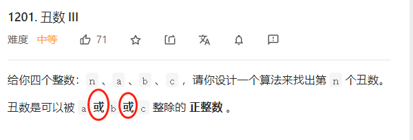
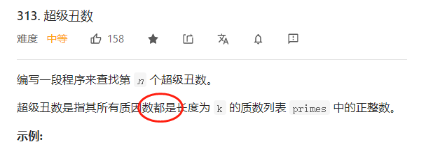

今日刷题情况：

目标：6个月内  争取 1500题， 争取 全站排名：1000名以内   参加微软、google面试

fighting！！！

个人刷题总结：

滑动窗口模板:
《挑战程序设计竞赛》这本书中把滑动窗口叫做「虫取法」，我觉得非常生动形象。因为滑动窗口的两个指针移动的过程和虫子爬动的过程非常像：前脚不动，把后脚移动过来；后脚不动，把前脚向前移动。

    def findSubArray(nums):
        N = len(nums) # 数组/字符串长度
        left, right = 0, 0 # 双指针，表示当前遍历的区间[left, right]，闭区间
        sums = 0 # 用于统计 子数组/子区间 是否有效，根据题目可能会改成求和/计数
        res = 0 # 保存最大的满足题目要求的 子数组/子串 长度
        while right < N: # 当右边的指针没有搜索到 数组/字符串 的结尾
            sums += nums[right] # 增加当前右边指针的数字/字符的求和/计数
            while 区间[left, right]不符合题意：# 此时需要一直移动左指针，直至找到一个符合题意的区间
                sums -= nums[left] # 移动左指针前需要从counter中减少left位置字符的求和/计数
                left += 1 # 真正的移动左指针，注意不能跟上面一行代码写反
            # 到 while 结束时，我们找到了一个符合题意要求的 子数组/子串
            res = max(res, right - left + 1) # 需要更新结果
            right += 1 # 移动右指针，去探索新的区间
        return res
滑动窗口中用到了左右两个指针，它们移动的思路是：以右指针作为驱动，拖着左指针向前走。右指针每次只移动一步，而左指针在内部 while 循环中每次可能移动多步。右指针是主动前移，探索未知的新区域；左指针是被迫移动，负责寻找满足题意的区间。
作者：fuxuemingzhu
来源：力扣（LeetCode）

4.22日

304\307\363 一起做 前缀和

针对不同的题目，我们有不同的方案可以选择（假设我们有一个数组）：

数组不变，求区间和：「前缀和」、「树状数组」、「线段树」

多次修改某个数，求区间和：「树状数组」、「线段树」

多次整体修改某个区间，求区间和：「树状数组」、「线段树」

多次将某个区间变成同一个数，求区间和：「线段树」

「线段树」代码很长，而且常数很大，复杂度表现不算很好。我们只有在不得不用的时候才考虑「线段树」。

作者：AC_OIer

307「树状数组」的代码 当作模板

    class NumArray {
    int[] tree;
    int lowbit(int x) {
        return x & -x;
    }
    int query(int x) {
        int ans = 0;
        for (int i = x; i > 0; i -= lowbit(i)) ans += tree[i];
        return ans;
    }
    void add(int x, int u) {
        for (int i = x; i <= n; i += lowbit(i)) tree[i] += u;
    }

    int[] nums;
    int n;
    public NumArray(int[] _nums) {
        nums = _nums;
        n = nums.length;
        tree = new int[n + 1];
        for (int i = 0; i < n; i++) add(i + 1, nums[i]);
    }
    
    public void update(int i, int val) {
        add(i + 1, val - nums[i]);
        nums[i] = val;
    }
    
    public int sumRange(int l, int r) {
        return query(r + 1) - query(l);
    }
    }
模板：

    // 上来先把三个方法写出来
    {
        int[] tree;
        int lowbit(int x) {
            return x & -x;
        }
        // 查询前缀和的方法
        int query(int x) {
            int ans = 0;
            for (int i = x; i > 0; i -= lowbit(i)) ans += tree[i];
            return ans;
        }
        // 在树状数组 x 位置中增加值 u
        void add(int x, int u) {
            for (int i = x; i <= n; i += lowbit(i)) tree[i] += u;
        }
    }

    // 初始化「树状数组」，要默认数组是从 1 开始
      {
        for (int i = 0; i < n; i++) add(i + 1, nums[i]);
    }

    // 使用「树状数组」：
    {   
        void update(int i, int val) {
            // 原有的值是 nums[i]，要使得修改为 val，需要增加 val - nums[i]
            add(i + 1, val - nums[i]); 
            nums[i] = val;
        }
        
        int sumRange(int l, int r) {
            return query(r + 1) - query(l);
        }
    }
线段树：
https://leetcode-cn.com/problems/range-sum-query-mutable/solution/xian-duan-shu-zu-shou-hui-tu-xiang-yi-qing-er-chu-/

4.23 日
今天回顾一下前几天的题目，刷了一下每日一题

368. 最大整除子集

DP 算法有点弱，找个时间好好练练，团灭一波题

4.24 日  377 背包问题 又是一道DP问题
这两天面完试 准备背包问题

4.28
剑指offer45 最小的数 VS 179 最大的数

剑指offer65

Python 负数的存储：
Python，Java 等语言中的数字都是以 补码 形式存储的。但 Python 没有 int , long 等不同长度变量，即在编程时无变量位数的概念。
获取负数的补码： 需要将数字与十六进制数 0xffffffff 相与。可理解为舍去此数字 32 位以上的数字（将 32 位以上都变为 00 ），从无限长度变为一个 32 位整数。
返回前数字还原： 若补码 aa 为负数（ 0x7fffffff 是最大的正数的补码 ），需执行 ~(a ^ x) 操作，将补码还原至 Python 的存储格式。 a ^ x 运算将 1 至 32 位按位取反； ~ 运算是将整个数字取反；因此， ~(a ^ x) 是将 32 位以上的位取反，1 至 32 位不变。

4.29 
青蛙过河 又是一道 DP题，今天有点晚了，明天起床再想dp方程。今天AC了10道题，明天起床加油。

4.30 
补码问题 https://cloud.tencent.com/developer/article/1658229
res -= i << 31 就是简单的模拟补码

5.2

Python排序容器类型：sortedlist、sorteddict和Sorted Set

https://www.5axxw.com/wiki/content/5nj8w4

一定要好好读题！！！

另外1201丑数III，明显是878题的升级版，为什么878是困难，这道题是中等【手动狗头】

